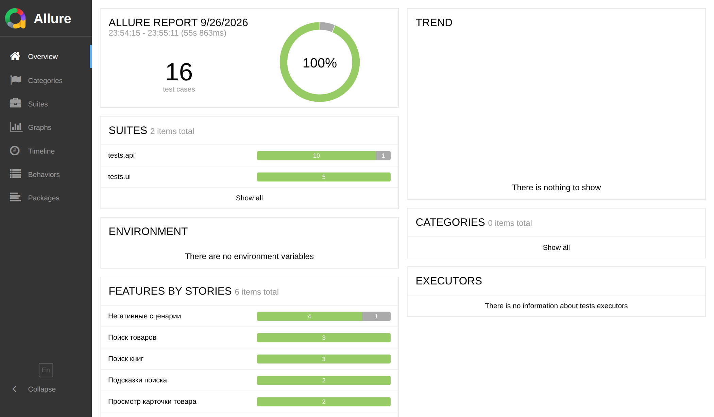
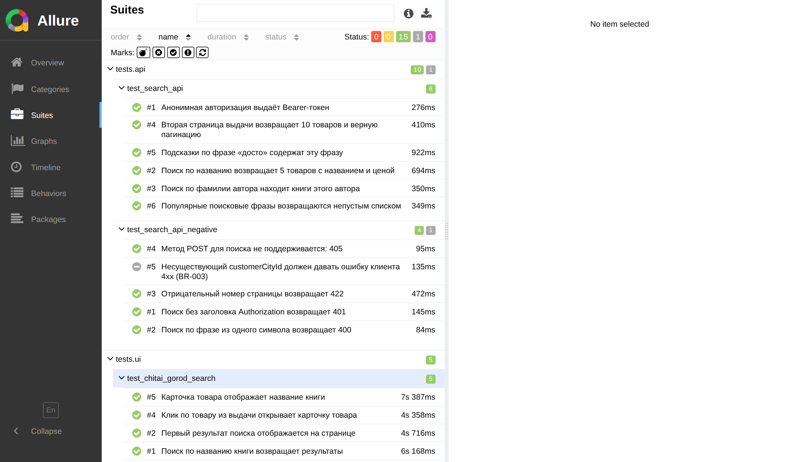
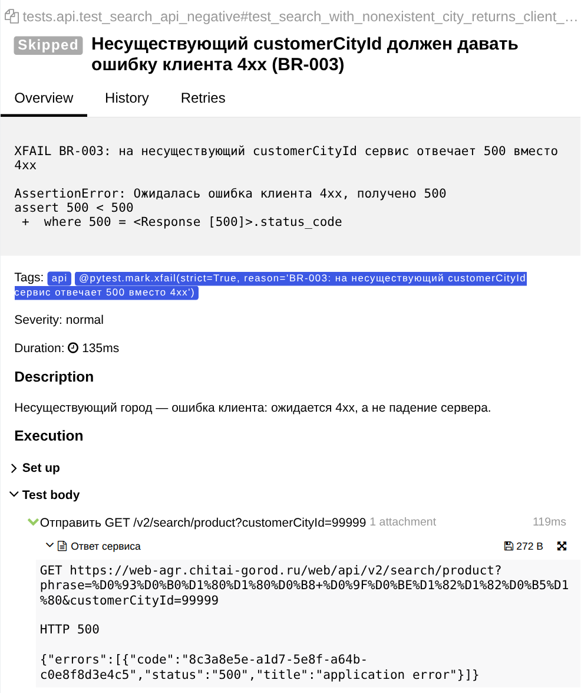

# Дипломная работа — автоматизация тестирования Читай-города

Проект автотестов для дипломной работы по профессии «Инженер по тестированию» (Sky.Pro). Автор — Селиванов Георгий.

Итоговый отчёт и вся тестовая документация (тест-план, тест-кейсы и чек-лист в XLS, коллекция Postman, баг-репорты, скриншоты прогонов, презентация, видеозащита): https://georgi1412qa.yonote.ru/share/5222c94a-8b37-4324-822a-e8b78ffc8325

## Что тестируется

Одно приложение — книжный интернет-магазин **Читай-город**:

- **UI:** сайт https://www.chitai-gorod.ru в гостевом режиме, без входа в аккаунт.
- **API:** открытое API поиска Читай-города, базовый адрес `https://web-agr.chitai-gorod.ru/web/api`. Авторизация анонимная: `POST /v1/auth/anonymous` выдаёт Bearer-токен, он передаётся в заголовке `Authorization`.

## Ключевые функции, покрытые тестами

1. **Поиск книги** — через интерфейс (по названию и по фамилии автора) и через API (`GET /v2/search/product`, постраничная выдача).
2. **Просмотр карточки товара** — переход из выдачи в карточку и отображение названия книги (UI).
3. **Подсказки и популярные запросы поиска** — `GET /v2/search/search-phrase-suggests` и `GET /v2/search/popular-search-phrases` (API).

| Набор | Файл | Тестов |
|---|---|---|
| UI, позитивные | `tests/ui/test_chitai_gorod_search.py` | 5 |
| API, позитивные | `tests/api/test_search_api.py` | 6 |
| API, негативные | `tests/api/test_search_api_negative.py` | 5 |

Негативные API-проверки опираются на реальную валидацию сервиса: 401 без токена, 400 на фразу из одного символа, 422 на отрицательный номер страницы, 405 на неподдерживаемый метод. Последний негативный тест фиксирует найденный дефект **BR-003** (несуществующий `customerCityId` → 500 вместо 4xx) и помечен `xfail(strict=True)`: пока дефект не исправлен, тест ожидаемо падает.

## Стек

- Python 3.12
- pytest — тест-раннер
- requests — API-тесты
- Playwright — UI-тесты, headless Chromium
- Allure — отчётность (`@allure.title`, `@allure.story`, `allure.step` во всех тестах, ответы API прикладываются к отчёту)

## Структура проекта

```
skypro-diploma-automation/
├── config.py                # адреса сайта и API, тестовые данные
├── conftest.py              # фикстуры: анонимный токен и сессия API, браузер и страница Playwright
├── requirements.txt
├── pytest.ini               # маркеры ui / api
├── setup.cfg                # настройки flake8
├── .gitignore
├── tests/
│   ├── api/
│   │   ├── test_search_api.py            # 6 позитивных тестов
│   │   └── test_search_api_negative.py   # 5 негативных тестов
│   └── ui/
│       └── test_chitai_gorod_search.py   # 5 позитивных тестов
├── screenshots/             # скриншоты отчёта Allure последнего прогона
└── README.md
```

## Установка

```bash
python -m venv venv
source venv/bin/activate        # Windows: venv\Scripts\activate
pip install -r requirements.txt
playwright install chromium
```

Логин, пароль и переменные окружения не нужны: сайт открыт в гостевом режиме, токен для API тесты получают сами.

## Запуск тестов

```bash
# все тесты (16 шт.: 11 API + 5 UI)
pytest --alluredir=allure-results

# только UI
pytest -m "ui" --alluredir=allure-results

# только API
pytest -m "api" --alluredir=allure-results

# отчёт Allure
allure generate allure-results --clean -o allure-report
allure open allure-report
```

## Качество кода

```bash
flake8 .
```

Отчёт линтера чистый (настройки — в `setup.cfg`). У всех функций есть аннотации типов. Тесты независимы друг от друга и от порядка запуска: у каждого UI-теста свой контекст браузера, API-тесты не меняют данные. Жёстких ожиданий (`time.sleep()`) нет — только явные ожидания Playwright.

## Статус проверки

Последний прогон — 26.09.2026, Windows, Python 3.12.10: **15 passed, 1 xfailed** за 56 секунд. Единственный xfail — тест на дефект BR-003, он падает ожидаемо.







## Найденные дефекты

- **BR-001** (Minor, приоритет Low): контраст текста бейджа скидки на главной — 4,04:1 при норме WCAG 2.1 AA 4,5:1.
- **BR-002** (Major, приоритет Medium): сдвиги макета при загрузке главной — CLS 0,7 при норме ≤ 0,1 (PageSpeed Insights, данные пользователей Chrome).
- **BR-003** (Major, приоритет Medium): `GET /v2/search/product` с несуществующим `customerCityId` (например, 99999) отвечает `500 application error` вместо ошибки клиента 4xx.

Полные баг-репорты со скриншотами — в итоговом отчёте по ссылке выше.
